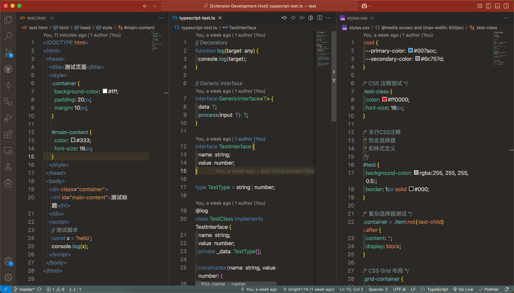

# Ancient China Theme

[English](README.md) | [简体中文](README.zh-CN.md) | [繁體中文](README.zh-TW.md)

A VSCode theme inspired by Chinese ancient temples and Mogao Grottoes.

## Themes

This extension includes two themes:

- Ancient Temple - Warm earthy tones inspired by traditional Chinese temples
- Mogao Grottoes - Cool tones inspired by the Dunhuang cave paintings

## Screenshots

## Installation

1. Install [Visual Studio Code](https://code.visualstudio.com/)
2. Launch Visual Studio Code
3. Choose **Extensions** from menu
4. Search for `Ancient China Theme`
5. Click **Install** to install it
6. From the menu bar click: Code → Preferences → Color Theme → **Ancient Temple** or **Mogao Grottoes**

## Future Plans

- Light themes inspired by:
  - [ ] Blue and White Porcelain (青花瓷)
  - [ ] Chinese Ink Painting (水墨画)
- Enhanced support for more programming languages
- Refinements based on user feedback

## Feedback

- Please report issues or submit pull requests on [GitHub](https://github.com/knight174/ancient-china-theme)

## License

[MIT License](LICENSE)
