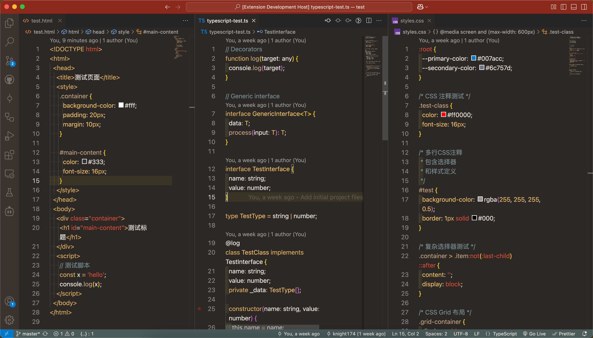
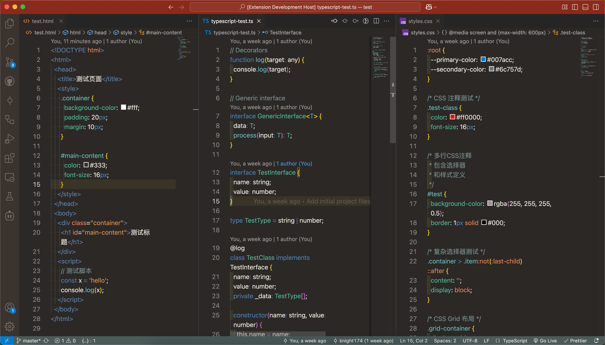

# 中國古風主題

[English](README.md) | [简体中文](README.zh-CN.md) | [繁體中文](README.zh-TW.md)

一個受中國古剎和莫高窟文化啟發的 VSCode 主題。

## 主題

本擴展包含兩個主題：

- 古剎主題 - 受傳統中國古剎啟發的暖色調主題
- 莫高窟主題 - 受敦煌壁畫啟發的冷色調主題

## 截圖

## 安裝

1. 安裝 [Visual Studio Code](https://code.visualstudio.com/)
2. 啟動 Visual Studio Code
3. 從選單中選擇 **擴展**
4. 搜尋 `Ancient China Theme`
5. 點擊 **安裝**
6. 從選單列點擊：程式碼 → 喜好設定 → 色彩主題 → **古剎主題** 或 **莫高窟主題**

## 未來計劃

- 明亮主題靈感來源：
  - [ ] 青花瓷
  - [ ] 水墨畫
- 增強對更多程式語言的支援
- 根據用戶反饋進行改進

## 反饋

- 請在 [GitHub](https://github.com/knight174/ancient-china-theme) 上報告問題或提交拉取請求

## 授權

[MIT 授權](LICENSE)
